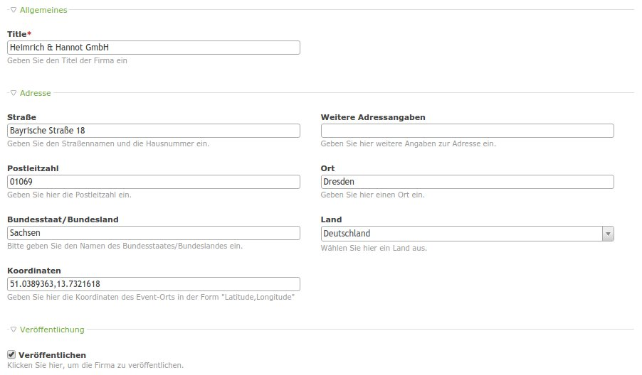

# Contao Companies

A module adding company handling to Contao for members and users.

*Company preview*

## Features

- adds a new company entity
- support for both members and users
- add member fields as contact person fields dynamically or just link a member as contact

### Fields

tl_company:

Name | Description
---- | -----------
title | The title of the company
street | The street of the company
street2 | An additional street value
postal | The postal code of the company
city | The city of the company
state | The state of the company
country | The country of the company
coordinates | The geo coordinates of the company getting updated on submit of a company